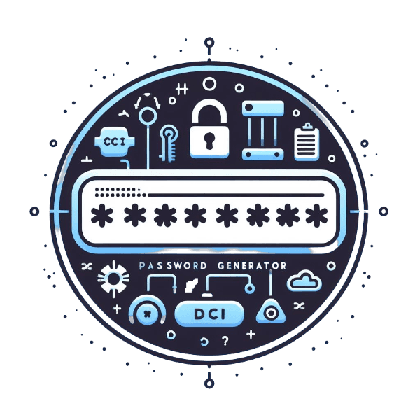

# DCI Passwort Generator 


|| [**Funktionsweise**](#funktionsweise) || [**Installation**](#installation) || [**Zusammenarbeit**](#zusammenarbeit) ||

Dieses Projekt ist eine Zusammenarbeit zwischen mir und meinem Klassenkameraden [Handrin](https://github.com/handrin-profil-link). Es handelt sich um einen Passwort-Generator, der in JavaScript geschrieben ist und in der Datei `main.js` gefunden werden kann.


## Funktionsweise

Der Passwort-Generator funktioniert durch die Kombination von zufällig ausgewählten Zeichen aus einem vordefinierten Zeichensatz. Dieser Zeichensatz kann Großbuchstaben, Kleinbuchstaben, Zahlen und/oder Sonderzeichen enthalten.

Die Länge des generierten Passworts kann vom Benutzer festgelegt werden. Der Generator stellt sicher, dass das Passwort immer die vom Benutzer gewählte Länge hat.


## Installation

1. Repository klonen. Nutzen Sie den Befehl git clone gefolgt von der URL des Repositories in Ihrem Terminal.
```bash
git clone git@github.com:mkamburdev/DCI-Passwort-Generator.git
```

2. Öffnen Sie ein Terminal im Projektordner.
3. Sie können das Programm durch Eingabe in die Befehlszeile wie im folgenden Beispiel starten.

```bash
node main.js 12
```
4. Die Zahl steht für die Zeichenanzahl des gewünschten Passwortes.


## Zusammenarbeit

Dieses Projekt wurde gemeinsam von mir und [Handrin](https://github.com/handrinh) durchgeführt. Wir hoffen, dass dieser Passwort-Generator nützlich ist und freuen uns auf euer Feedback.